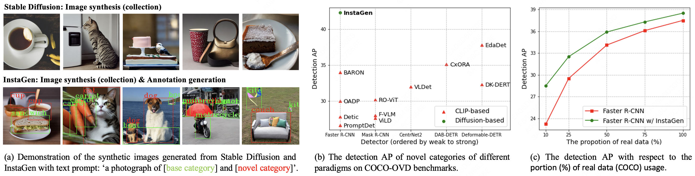
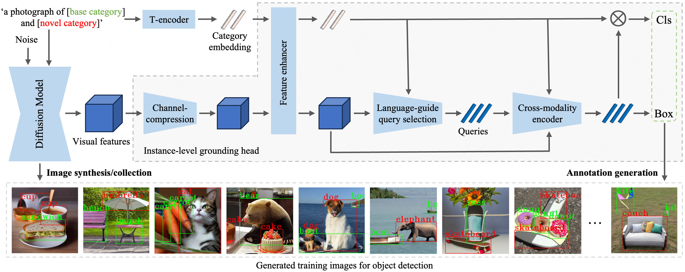

<div align="center">
  
# InstaGen: Enhancing Object Detection by Training on Synthetic Dataset (CVPR 2024)
[[Paper](https://arxiv.org/abs/2402.05937)]
[[Project Page](https://fcjian.github.io/InstaGen)]
<be>
</div>



## Introduction

In this paper, we present a novel paradigm to enhance the ability of object detector, e.g., expanding categories or improving detection performance, by training on **synthetic dataset** generated from diffusion models. Specifically, we integrate an instance-level grounding head into a pre-trained, generative diffusion model, to augment it with the ability of localising instances in the generated images. The grounding head is trained to align the text embedding of category names with the regional visual feature of the diffusion model, using supervision from an off-the-shelf object detector, and a novel self-training scheme on (novel) categories not covered by the detector. We conduct thorough experiments to show that, this enhanced version of diffusion model, termed as **InstaGen**, can serve as a data synthesizer, to enhance object detectors by training on its generated samples, demonstrating superior performance over existing state-of-the-art methods in open-vocabulary (+4.5 AP) and data-sparse (+1.2 ∼ 5.2 AP) scenarios.

## Methodology


**updates**
- April 7, 2024: and the code and models for open-vocabulary COCO benchmark
- February 8, 2024: initial release

## Synthetic Dataset


## Prerequisites
```Installation
# Step 1. Create a conda environment and activate it
conda create --name instagen python=3.8 -y
conda activate instagen

# Step 2. Install the requirements for SDM fine-tuning
cd InstaGen/
pip install -r requirements.txt

# Step 3. Install mmdetection
cd mmdetection/
pip install -U openmim
mim install mmengine
mim install "mmcv>=2.0.0"
pip install -v -e .
```

## Demo
We present a simple demo of utilizing InstaGen to generate images and the bounding boxes with the original model weights of SDM.
1. Download the original model weights of SDM, listed as [sd-v1-4.ckpt](https://huggingface.co/CompVis/stable-diffusion-v-1-4-original/blob/main/sd-v1-4.ckpt), to 'checkpoints/stable-diffusion-v-1-4-original/'
2. Download the model weights of InstaGen, listed as [instagen-4scale_fd_8xb2-12e_coco.pth](https://drive.google.com/file/d/1mAGlcdodboJwiGHLp9DfGDaMyDPweLQu/view?usp=sharing), to 'mmdetection/checkpoints/'
3. Run demo:
```
sh instagen_scripts/demo_instagen.sh
```

## Fine-tune SDM
1. Download the [COCO](https://cocodataset.org/) dataset to 'mmdetection/data/coco'
2. Download the [annotation](https://drive.google.com/file/d/1C41YDwP23Lh2pU33O_NNCaboMIdyt0Gv/view?usp=sharing) of the base categories to 'mmdetection/data/coco/annotations/'
3. Download the original model weights of SDM, listed as [sd-v1-4-full-ema.ckpt](https://huggingface.co/CompVis/stable-diffusion-v-1-4-original/blob/main/sd-v1-4-full-ema.ckpt), to 'checkpoints/stable-diffusion-v-1-4-original/'
4. Fine-tune SDM:
```
sh instagen_scripts/finetune_sdm.sh
```

## Train InstaGen
1. Download the [model weights](https://download.openmmlab.com/mmdetection/v2.0/swin/mask_rcnn_swin-s-p4-w7_fpn_fp16_ms-crop-3x_coco/mask_rcnn_swin-s-p4-w7_fpn_fp16_ms-crop-3x_coco_20210903_104808-b92c91f1.pth) of the pre-trained detector to 'mmdetection/checkpoints/'
2. To enhance training efficiency, we generate images in advance and store the latent representations during the second-to-last denoising step:
```
sh instagen_scripts/generate_image.sh
```
3. Generate annotation files:
```
sh instagen_scripts/generate_base_ann.sh
```
4. Generate class embeddings:
```
sh instagen_scripts/generate_class_embedding.sh
```
5. Train InstaGen:
```
sh instagen_scripts/train_instagen.sh
```

## Train detector
1. Predict the pseudo-labels of the synthetic images with InstaGen:
```
sh instagen_scripts/infer_instagen.sh
```
2. Generate annotation file for training detector:
```
sh instagen_scripts/generate_novel_ann.sh
```
3. Train detector:
```
sh instagen_scripts/train_detector.sh
```

## Inference
1. Detector inference:
```
sh instagen_scripts/infer_detector.sh
```

# Dataset & Models
For your convenience, we provide the synthetic dataset and the trained models in the open-vocabulary COCO benchmark.
1. The synthetic dataset can be downloaded [here]()
2. Models

Model | AP<sub>all | AP<sub>base | AP<sub>novel | Download
--- |:---:|:---:|:---:|:---:
[Fine-tuned SDM](configs/sd-finetune/coco_base.yaml) | -- | -- | -- | [google]()
[InstaGen](mmdetection/configs/instagen/instagen-4scale_fd_8xb2-12e_coco.py) | -- | -- | -- | [google](https://drive.google.com/file/d/1mAGlcdodboJwiGHLp9DfGDaMyDPweLQu/view?usp=sharing)
[Faster RCNN](mmdetection/configs/instagen/faster-rcnn_r50-caffe_c4-1x_coco-ovd_instagen-dataset.py) | 52.2 | 55.7 | 42.4 | [google](https://drive.google.com/file/d/1W2n38jxdkhbOfog3HVezbYm_Xt65PxSm/view?usp=sharing)

## Acknowledgement

Thanks [Stable Diffusion](https://github.com/CompVis/stable-diffusion), [Stable Diffusion Finetuning](https://github.com/LambdaLabsML/examples/tree/main/stable-diffusion-finetuning), [Grounded Diffusion](https://github.com/Lipurple/Grounded-Diffusion) and [MMDetection](https://github.com/open-mmlab/mmdetection) team for the wonderful open source project!

## Citation

If you find InstaGen useful in your research, please consider citing:

```
@inproceedings{feng2024instagen,
    title={InstaGen: Enhancing Object Detection by Training on Synthetic Dataset},
    author={Feng, Chengjian and Zhong, Yujie and Jie, Zequn and Xie, Weidi and Ma, Lin},
    booktitle={Proceedings of the IEEE / CVF Computer Vision and Pattern Recognition},
    year={2024}
}
```


